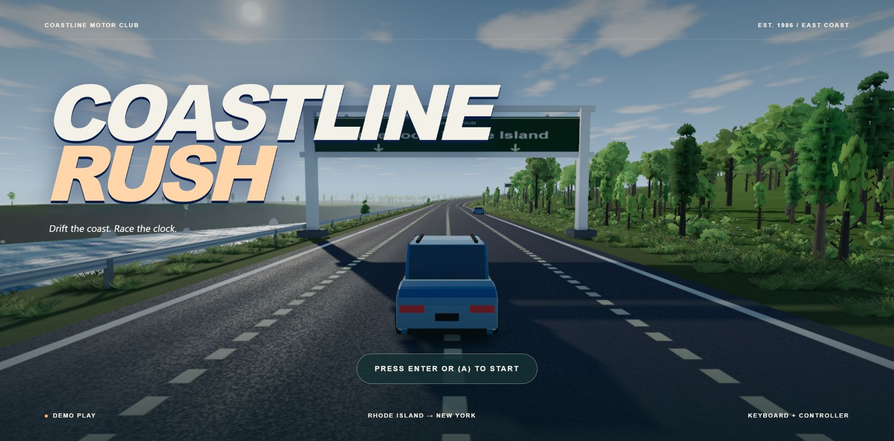
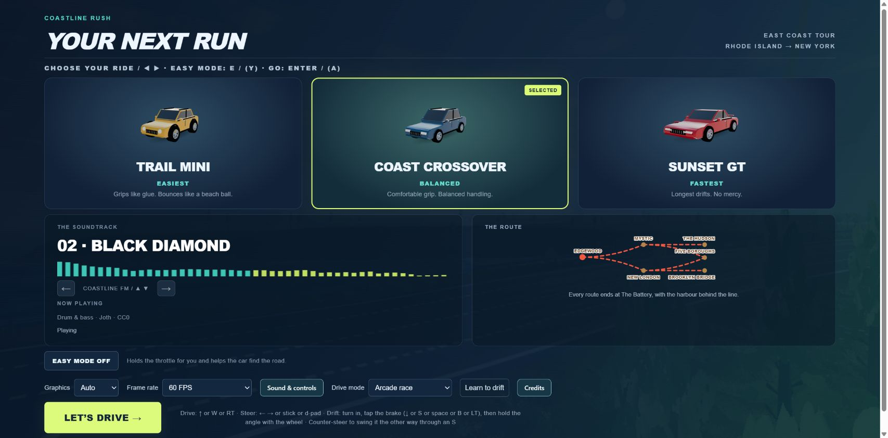
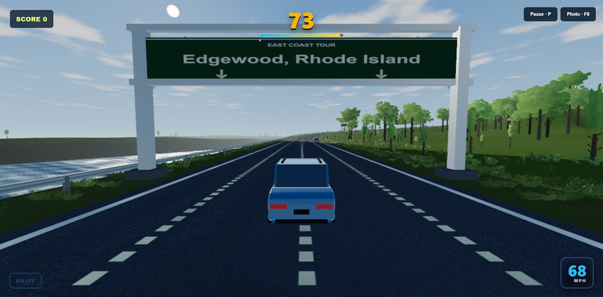
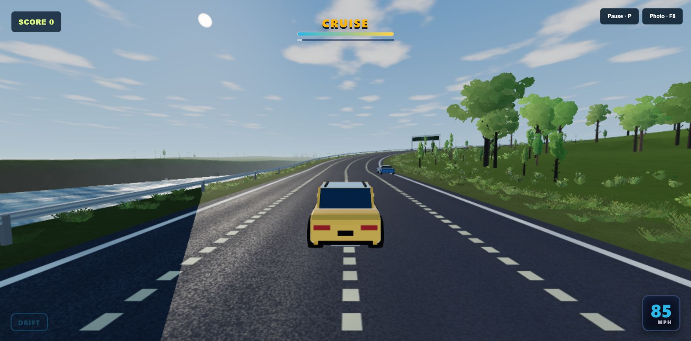
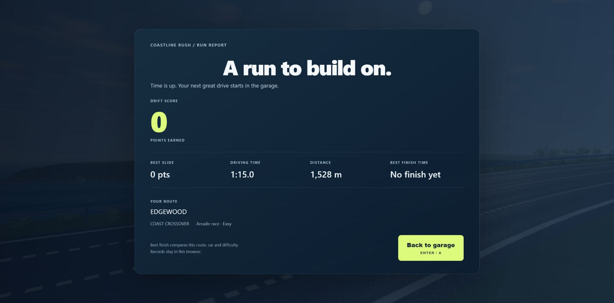

# Coastline Rush

A desktop browser arcade driving game with branching coastal routes, traffic, and drifting.

## Screenshots

### Title screen



### Choose a ride

Pick from 3 original vehicles, choose music, and set the driving mode in the garage.



### Race the clock

The arcade race shows the remaining time, speed, and drift score while driving the coast.



### Free Drive

Cruise without a countdown in the Trail Mini, with traffic sharing the road.



### Review a run

The run report shows the drift score, best slide, driving time, distance, and route.
This example shows a timed-out run.



## Play

Requires Node.js 20.19 or newer within 20.x, or Node.js 22.12 or newer, and a browser with WebGL 2.

```sh
npm ci
npm run build
npm run preview
```

Open the local address printed in the terminal.
For development, use `npm run dev`.

For a prebuilt web archive, serve the extracted folder through an HTTP server; opening `index.html` directly is not supported.
The game needs no account or backend service.

## Controls

Press Enter or controller A to open the garage.
The garage lists steering, acceleration, braking, and drift controls.
Press P or Escape to pause, F8 to save a photo, and F9 to save a diagnostic report.
Sound, graphics, and controller settings are available in the garage and pause menu.
Start with Auto graphics and a 60 FPS limit.

## Features

Four route combinations, timed races, untimed Free Drive, and an optional driving lesson.
Three original vehicles: Trail Mini, Coast Crossover, and Sunset GT.
Drift scoring, traffic with lane-change signals, music, and voiced feedback.
Settings and records are saved in the browser.

## Compatibility

Desktop Chromium is the primary tested browser.
A WebGL 2 capable graphics device and hardware acceleration are required; performance varies by hardware and graphics settings.
Use Auto graphics first and reduce the frame-rate limit to 30 FPS if 60 FPS is unstable.
Settings and records stay in browser storage; clearing site data removes them.

## Tests

Run `npm test` after building.
Browser checks require Playwright Chromium: `npx playwright install chromium`.

## Credits and license

See [CREDITS.md](CREDITS.md) for asset sources and [THIRD-PARTY-NOTICES.md](THIRD-PARTY-NOTICES.md) for third-party terms.
Original game code and original procedural assets are available under the [MIT license](LICENSE).
Third-party licenses apply only to their respective components.
